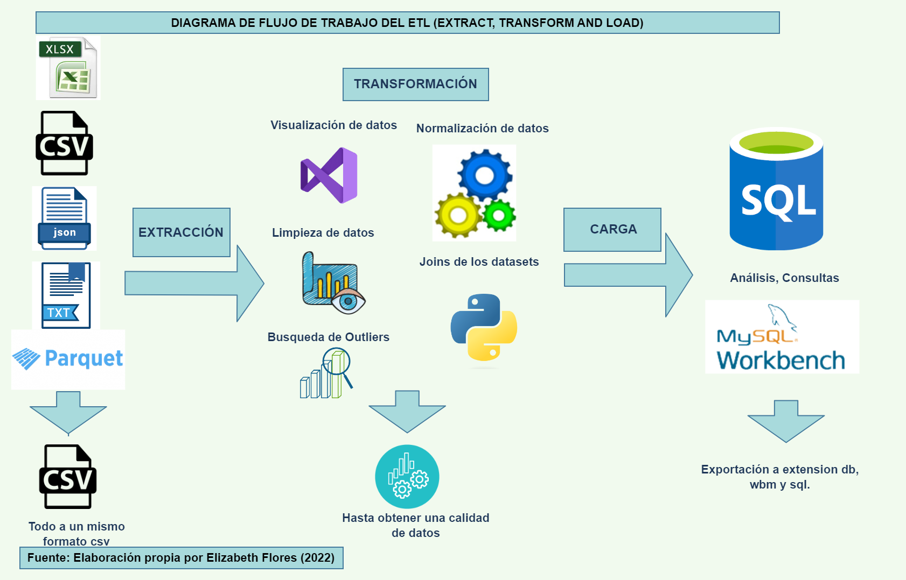

# Proyecto: Relevamiento de precios en distintos mercados
En este proyecto se realizó un proceso de ETL (Extract, transform and Load) a partir de un conjunto de datos que se enfocó en una misma perspectiva de negocio. Los datos vienen de diversas fuentes de relevamiento  de precios en distintos mercados de Argentina, luego se realizó el DER a través de MySQL Worbench. 

El proceso del video del proyecto en este link

## Diagrama del Flujo de Trabajo del ETL

Entonces de acuerdo a las tres etapas del proceso de ETL y a los subtemas requeridos se presenta lo siguiente:

## ETAPA 1: EXTRACCIÓN
Primeramente los datasets se adquirieron del sitio de Github, en formatos xlsx, csv, json, txt y parquet, a los cuales se les llevó a una misma extensión que es csv, ya que es mas recomendable trabajar con dicha extensión para este tipo de datos (datasets). Para esta etapa se utilizó el entorno de desarrollo de Visual Studio y como lenguaje de programación Python.

## ETAPA 2: TRANSFORMACIÓN
Esta etapa se utilizó la herramienta de Python y está dividida en los siguientes subetapas:
### 1) Visualización de datos
Aquí se hizo una visualización de los datos, se utilizó módulos de Pyyton como .head(), sample(), df.isnull().sum() para ver como están están formados los datos para luego seguir con la demás auditoria.
### 3) Limpieza de datos
Para los datos nulos decidí eliminar algunas columnas siempre cuando la mayoría (>70 %) este nula, asi como también en vez de eliminar filas decidí usar el módulo de .fillna(method="bfill") que rellena los datos nulos, en base al valor de la siguiente fila. 
### 4) Búsqueda de Outliers
Utilicé sample() para ver que valores son atípicos, osea diferentes a la mayoría o que no suceden en la vida real, también se observó si había valores duplicados en los id de los datasets.
### 5) Normalización de datos
Tanto en las columnas osea los encabezados se normalizaron algunos headers como el id a producto_id, en caso de las filas (registros) hubieron varios outliers en varias columnas y se les procedió a etiquetarlos de manera correcta haciendo transformación en los campos numéricos poniendo la misma cantidad de dígitos para todos, o reemplazando el "." por la "," para la columna precio por ejemplo. 
### 6) Joins de los datasets
Se utilizó la función concat en Python para concatenar las tablas de precios_semanas, ya que tenían los misma nomenclatura en las columnas y los registros eran similares, se procedió a juntar en una sola tabla general las 5 tablas de dimensiones para ser más óptimo en la demás auditoría.

## ETAPA 3: CARGA
Por último, se utilizó la librería de SQLAlchemy en Python para poder conectar a la base de datos que previamente lo cree en MySQL "preciosdb", de ahí cargué los datasets todos ok a mi base de datos, luego se hizo los alter tables, para asignar PRIMARY KEY y FOREIGN KEY que lo ameritaba.
La base de datos generada finalmente se muestra así:

### query
Finalmente, se hizo una consulta para contrastar si la base de datos funciona: Precio promedio de la sucursal 9-1-688, el cual dio como resultado: 203.64690382081687.

